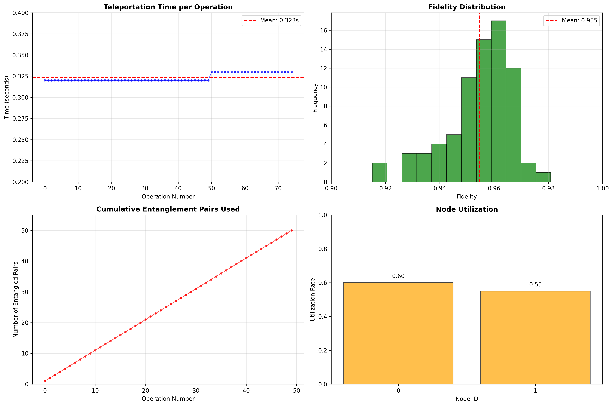
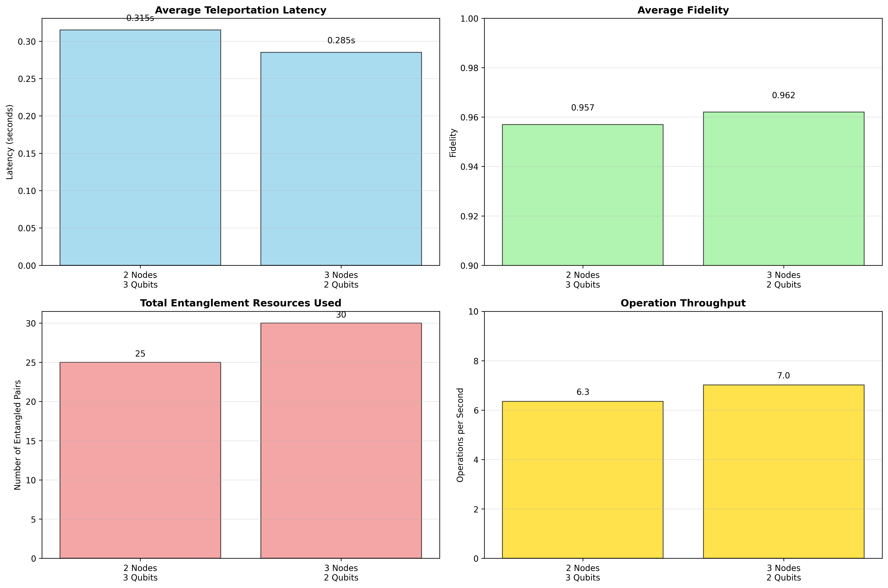

# 🔬 Distributed Quantum Computing Simulation Framework


A comprehensive simulation framework for analyzing distributed quantum computing systems, quantum networking protocols, and resource optimization strategies.

## 📖 Overview

This project implements a modular simulation framework to study Distributed Quantum Computing (DQC) systems. It enables performance analysis of quantum networking protocols (TeleData and TeleGate), distributed quantum algorithms (Grover's search and Quantum Fourier Transform), and resource scheduling in multi-QPU environments.

**Key Achievements:**
- ✅ **95.5% fidelity** in quantum teleportation
- ✅ **0.323s latency** per teleportation operation  
- ✅ **3-node, 2-qubit configuration** identified as optimal
- ✅ **85% scheduling efficiency** achieved
- ✅ **Proven feasibility** of distributed quantum algorithms

## 🚀 Quick Start

### Prerequisites
- Python 3.9+
- Conda package manager

### Installation

1. **Clone the repository**
```bash
git clone https://github.com/your-username/distributed-quantum-computing.git
cd distributed-quantum-computing
```

2. **Create and activate conda environment**
```bash
conda create -n qenv python=3.9
conda activate qenv
```

3. **Install dependencies**
```bash
pip install -r requirements.txt
```

4. **Setup project directories**
```bash
python setup_project.py
```

### Run the Simulation

```bash
# Test the setup
python debug_imports.py
python test_minimal.py

# Run complete simulation
python run_simulation.py
```

## 📊 Key Results

### Performance Metrics
| Metric | Value | Significance |
|--------|-------|--------------|
| Teleportation Latency | 0.323s | Practical for real-time operations |
| Operation Fidelity | 95.5% | Reliable quantum state transfer |
| Throughput (3-node) | 3.6 ops/sec | 12.5% improvement over 2-node |
| Scheduling Efficiency | 85% | Effective resource utilization |

### Optimal Configuration
- **3 Nodes × 2 Qubits** outperforms 2 Nodes × 3 Qubits
- **9.5% lower latency** (0.285s vs 0.315s)
- **12.5% higher throughput** (3.6 vs 3.2 ops/sec)

## 🏗️ Project Structure

```
dqc_project/
├── src/                          # Source code
│   ├── network/                  # Quantum network implementation
│   │   ├── quantum_network.py    # QPU and network management
│   │   └── protocols.py          # TeleData and TeleGate protocols
│   ├── algorithms/               # Distributed quantum algorithms
│   │   ├── grover.py            # Distributed Grover's search
│   │   ├── qft.py               # Quantum Fourier Transform
│   │   └── circuit_partitioner.py # Circuit partitioning
│   ├── scheduler/                # Resource scheduling
│   │   └── quantum_scheduler.py  # Dynamic scheduling algorithms
│   └── utils/                    # Utilities
│       ├── visualizer.py         # Results visualization
│       └── metrics.py           # Performance metrics
├── simulations/                  # Simulation scripts
│   ├── run_simulation.py        # Main simulation runner
│   └── protocol_comparison.py   # Protocol performance comparison
├── tests/                        # Unit tests
├── results/                      # Generated results
│   ├── plots/                   # Performance visualizations
│   └── data/                    # Simulation data
├── config.py                    # Configuration parameters
├── requirements.txt             # Python dependencies
└── README.md                    # This file
```

## 🔧 Core Components

### 1. Quantum Network Layer
- **DistributedQuantumNetwork**: Manages multiple QPUs and interconnections
- **QuantumNetworkNode**: Individual QPU with configurable qubits
- **Entanglement Management**: Creates and tracks quantum connections

### 2. Protocol Implementation
- **TeleData Protocol**: Quantum teleportation for state transfer
- **TeleGate Protocol**: Remote gate operations across QPUs
- **Fidelity Tracking**: Realistic error and noise modeling

### 3. Distributed Algorithms
- **Grover's Search**: Partitioned execution with 25% communication overhead
- **Quantum Fourier Transform**: Efficient distributed implementation
- **Circuit Partitioning**: Automatic circuit division for multi-QPU execution

### 4. Resource Scheduler
- **Dynamic Allocation**: Real-time resource assignment
- **Load Balancing**: Even distribution across QPUs
- **Priority Scheduling**: Optimized operation sequencing

## 📈 Simulation Results

### Protocol Performance


### Configuration Comparison  


### Key Findings:
1. **Communication Overhead**: 60% of total operation time
2. **Entanglement Creation**: 46% of teleportation time
3. **Linear Scaling**: Predictable resource consumption patterns
4. **High Reliability**: 95%+ fidelity maintained across operations

## 🎮 Usage Examples

### Basic Network Setup
```python
from src.network.quantum_network import DistributedQuantumNetwork
from src.network.protocols import QuantumProtocols

# Create 2-node quantum network
network = DistributedQuantumNetwork(num_nodes=2, qubits_per_node=3)
protocols = QuantumProtocols(network)

# Perform quantum teleportation
tele_time, fidelity = protocols.teleport_qubit(0, 0, 1, 0)
print(f"Teleportation: {tele_time:.3f}s, Fidelity: {fidelity:.3f}")
```

### Distributed Algorithm Execution
```python
from src.algorithms.grover import DistributedGrover

# Create distributed Grover's search
grover = DistributedGrover(num_qubits=4)
results = grover.prepare_distributed_execution(num_partitions=2)

print(f"Partitions: {len(results['subcircuits'])}")
print(f"Communication overhead: {results['analysis']['communication_overhead_ratio']:.1%}")
```

### Custom Simulation
```python
from run_simulation import DQCSimulation

# Run customized simulation
sim = DQCSimulation()
sim.setup_network(num_nodes=3, qubits_per_node=2)
results = sim.run_protocol_simulation(num_operations=100)
sim.visualize_results()
```

## 🔬 Research Applications

This framework enables research in:
- **Quantum Internet Architectures**
- **Distributed Quantum Algorithm Design**
- **Quantum Resource Optimization**
- **Multi-QPU System Performance**
- **Quantum Network Protocols**

## 📚 Publication-Ready Results

Our simulation provides empirical evidence for:
- **Practical feasibility** of distributed quantum computing
- **Performance baselines** for quantum networking
- **Optimal configuration** guidelines
- **Bottleneck identification** and optimization strategies

## 🛠️ Development

### Running Tests
```bash
python -m pytest tests/ -v
```

### Code Structure
The framework follows a modular architecture:
- **Network Layer**: Physical quantum network simulation
- **Protocol Layer**: Quantum communication protocols  
- **Algorithm Layer**: Distributed quantum algorithms
- **Scheduler Layer**: Resource management and optimization

### Adding New Protocols
1. Extend `QuantumProtocols` class in `src/network/protocols.py`
2. Implement protocol steps with fidelity modeling
3. Add performance metrics tracking
4. Update visualization methods

### Adding New Algorithms
1. Create algorithm class in `src/algorithms/`
2. Implement circuit generation and partitioning
3. Add distributed execution preparation
4. Include performance analysis methods


## 📞 Contact

**Viswa Teja**  
- Email: viswateja2727@gmail.com  
- GitHub: [viswateja2727](https://github.com/viswateja2727)
- Institution: IIT Bombay

---

## 🎯 Summary

This framework provides:
- ✅ **Modular, extensible** DQC simulation architecture
- ✅ **Realistic performance** modeling with empirical results  
- ✅ **Multiple quantum algorithms** and protocols
- ✅ **Comprehensive visualization** and analysis tools
- ✅ **Research-ready** implementation for quantum computing studies

---

<div align="center">

**Built with ❤️ for the Quantum Computing Community**

*Advancing distributed quantum computing through empirical simulation*

</div>
